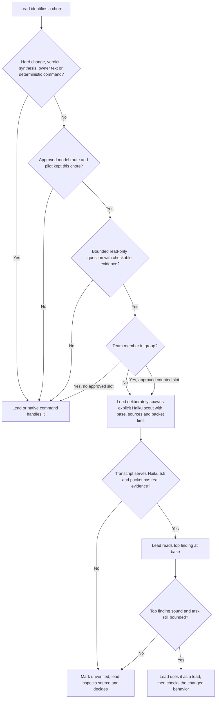

# Team 1 · prose at the choice, mechanisms at the blind spots

## Verdict

Keep the lead responsible for deciding whether a narrow, read-only evidence chore is worth a separate Haiku job. Put one routing rule where the coordinator chooses a job and one bounded packet contract in the scout role. Do not route by inferred task shape. Add runtime work only for facts that prose cannot supply: which model actually answered, its usage, and a safe bridge route. The pilot gates standing helper choices; Adam's allowance decision also gates **team** scouts. This file proposes changes, not an authorization to run a helper.

## Delegation map

“After pilot” means the task-specific pilot in `pilot.md` keeps that chore; team-scout rows also require Adam's allowance decision, and all group helper rows require a real group trial. “No” means no Haiku helper at that decision point. The agent chooses a helper; the command never chooses it from task text.

| Place | File and hook or function | Who decides today | Haiku fit | Signal that should reach the agent |
| --- | --- | --- | --- | --- |
| Choose work, ticket, board and spawn route | `templates/agents.md:62-66,141-147`; `src/commands/spawn.ts:92-110` | Plant coordinator | No for choice; after pilot for separate scout | Beside the explicit board route: a scout is optional only for a bounded, checkable evidence question; lead owns the spawn decision. |
| Coordinator's prompt on each choice | `hook/communication.ts:39-62,93-127` (`before_agent_start`) | Plant coordinator | After pilot | The shop manual already rides every non-job call, so use its routing line before adding a spawn hook. |
| Create role job | `src/commands/spawn.ts:73-82` (`resolvePreamble`); `templates/agents.md:85-93` | Coordinator | After pilot | `--role scout --detached` selects a read-only preamble; explicit board-approved engine, provider, model and thinking remain the caller's choice. |
| Read seam before a worker starts | `templates/agents.md:166-170` (handoff and own-hands rule) | Coordinator | After pilot | Ask for seam, covering test and missing evidence only when the ticket does not already answer them; top finding remains a lead, not a fact. |
| Worker begins a slice or meets an unknown | `templates/worker.md:19-35`; `hook/communication.ts:98-103` | Worker | After pilot for internal scout only | Worker does **not** receive `agents.md` from the communication hook. If approved, put a short rule in its own preamble; otherwise use its existing edit-first triage. |
| Worker launches a built-in scout | `src/runtime/engine.ts:218-242` (`argvFor`, bridge loading); `:134-197` (`prepareSkillConfig`) | OMP worker if allowed | After pilot and route proof | A per-subagent model override plus bridge loading is needed; the current bridge loads only when the parent job itself uses `pi-claude/`. Do not silently use `anthropic/`. |
| Failing test or log | `templates/worker.md:24-29` | Worker or coordinator | After pilot | Give the first assertion, related code path, independent failures, exact command/output; worker still fixes and checks the slice. |
| Failed/stopped job wake | `src/job/wake-text.ts:55-83` (`completionWake`); `src/integrations/coordinator-wake.ts:75-84` | Origin coordinator | After pilot | Put an optional triage cue in the shared failed-state handoff sentence (`wake-text.ts:61-64`). OMP overrides the later instruction with a generic landing instruction; a cue there would miss OMP. Never auto-spawn. |
| Inspect a candidate and decide to land | `templates/agents.md:148-154`; `src/commands/watch.ts:41-75` | Coordinator | No for decision | Read diff, checks, state and branch before a landing choice. Watching only changes wake recipient, not authority. |
| Review evidence pre-pass | `templates/reviewer.md:7-20`; `templates/agents.md:150-151` | Reviewer of record | After pilot, checklist only | List acceptance bullets with diff/check evidence and gaps; never issue PASS/FAIL or clear a finding. |
| Independent review of record | `templates/reviewer.md:13-20`; `src/commands/spawn.ts:73-82` | Reviewer of record | No | Fresh reviewer retains verdict and risk judgment. The scout role must not replace `--review`. |
| Research reports and judge source pre-pass | `templates/researcher.md:7-13`; `templates/judge.md:7-12` | Researcher, then judge | After pilot, source gaps only | Report uncited claims with locations; judge still decides divergence and the spec input. |
| Quality and picture | `templates/quality.md:7-17`; `templates/picture.md:7-19` | Quality/picture job | No | Vision, human-readable map and product judgment stay with the lead model; `picture tick` already filters cited changes (`templates/agents.md:155-156`). |
| Spec keeper | `src/commands/keeper.ts:43-49,108-115`; `templates/keeper.md:3-20` | Lead starts keeper | No | It changes ticket, board and map links on the landing branch; deterministic `ticket check` and strict map check remain commands. |
| Continue, steer and recovery | `src/commands/continue.ts:168-200`; `src/commands/steer.ts:9-12`; `hook/steering.ts:65-103` | Coordinator; group members cannot steer | No automatic reroute | Continuation keeps its role/engine and explicit model choice; do not switch a failed job to Haiku or treat a peer message as a steer. |
| Team hypothesis, scout and worker slots | `templates/coordinator.md:3-11`; `templates/group-member.md:3-9`; `src/commands/spawn.ts:98-110` | Team coordinator; lead controls allowance | After pilot for scout; no for hypothesis/worker | Publish own hypothesis first. If Adam approves, a team scout is a counted launch; workers cannot launch helpers. |
| Built-in team helper attempt | `hook/group-peer.ts:161-169` (`tool_call`, `before_subagent_spawn`); `src/commands/group.ts:165-169` | Blocked for members, not owner-facing lead | No today | A prose edit alone cannot enable a team helper. The lead pane has no `LIMEN_GROUP_ID`, so its own helper is outside the team's fixed roster; still no unapproved model spend. |
| Peer findings and team synthesis | `hook/group-peer.ts:171-184` (`tool_result`); `src/job/group-events.ts:217-266` (`acceptBatch`) | Team coordinator | No for reply or synthesis | Peer data is informational; test the claim instead of accepting it. Delivery batches max eight events/8,000 characters. |
| Group cabinet digest and candidate comparison | `src/job/group-events.ts:217-266`; `src/commands/group.ts:537-567` (`printGroupStatus`) | Owner-facing group lead | After pilot and group trial, facts only | Lead may deliberately launch a lead-side read-only fact helper outside team slots; the team-allowance question applies to team scouts. List claim, team, SHA/artifact, check output, uncertainty and conflict, never rank or choose. |
| Finished job summary | `src/job/wake-text.ts:13-42` (`handoffExcerpt`) | Coordinator reads worker result | No | The wake already carries the final message; avoid another model hop. Its limit is **15 lines and 1,200 characters**, whichever ends first. |
| Actual served model and tokens | `src/runtime/stream.ts:37-66` (`interpret`); `src/commands/jobs.ts:303-365,415-454`; `src/job/wake-text.ts:55-83` | No displayed comparison today | Mechanism required | Read assistant `model`/`usage` from session JSONL and requested model from job route; show mismatch in `jobs` and the wake, never claim a match if no transcript, and show input/output/cache read/write in `jobs`. |
| Local bridge route | `src/runtime/engine.ts:221-242` (`argvFor`); `study.md:15-28` | OMP model catalog | Mechanism required | Add Haiku 5.5 to the **local** bridge catalog and check Claude transcript `message.model`; `--model` alone currently silently serves 4.5. |
| Deterministic status, tests, picture and ticket checks | `templates/agents.md:103-108,174-176`; `templates/keeper.md:16-20` | CLI/native checks | No | Run commands; never ask Haiku to restate their output without a separate evidence question. |

`templates/limen-extension.ts:5-11` loads the communication, steering, group-peer and wake hooks. `hook/hosted.ts:140-201` records lifecycle, activity and tool count, not routing. `src/commands/webhook.ts:4-8` sends a fixed test event, not a delegation decision. `src/job/group-cabinet.ts:25-46` stores group/team lead routes; it has no helper default. The board's standing model and reasoning choice is `spec/build.md:5-12`; its active F936 line (`:26-27`) explicitly says **read-only group, no code lands, pilot waits for Adam**.

## Knowledge from fetched sources

1. **Simple before clever routing.** Anthropic says “consider adding complexity *only* when it demonstrably improves outcomes” and routing works where “classification can be handled accurately” ([Building effective agents](https://www.anthropic.com/engineering/building-effective-agents), “Combining and customizing” and “Workflow: Routing”). Limen should use a lead judgment over a free-text task, not a task-shape classifier.
2. **Delegate a bounded objective and return compression.** Anthropic says “Each subagent needs an objective, an output format, guidance on the tools and sources to use, and clear task boundaries,” and calls search “compression” ([Multi-agent research system](https://www.anthropic.com/engineering/multi-agent-research-system), “Prompt engineering and evaluations” and “Benefits”). Give the scout one evidence question and a short packet, not authority to implement or synthesize.
3. **Separate context and tool permissions are useful, but not free.** Claude Code says a subagent “runs in its own context window with a custom system prompt, specific tool access” and “returns only the summary” ([Subagents](https://code.claude.com/docs/en/sub-agents), introduction). A Limen role preamble alone is not a tool allowlist; check its clean worktree and no commits, then investigate a real read-only tool restriction if the pilot shows a need.
4. **Use actual tasks and count overhead.** Anthropic says “Test with your actual prompts and data” ([Choosing a model](https://platform.claude.com/docs/en/about-claude/models/choosing-a-model), “Decide whether to upgrade”). `pilot.md:38-103` already pairs five known Limen tasks with oracles and counts lead/helper time, turns, tokens, mistakes and retries; subscription quota and cold-start cost mean list price alone cannot justify a helper.
5. **Cascades require evidence, not a default switch.** FrugalGPT proposes an “LLM cascade which learns which combinations of LLMs to use for different queries” ([abstract](https://arxiv.org/abs/2305.05176)); RouteLLM trains routers with “human preference data and data augmentation” ([abstract](https://arxiv.org/abs/2406.18665)). Neither result validates an untrained classifier over Limen's spawn text; pilot by chore and keep lead-controlled escalation.
6. **Haiku fits extraction; hard decisions remain harder.** Anthropic calls Haiku 5.5 suitable for “classification, routing, extraction, and subagent tasks” ([Haiku 5.5 changes](https://platform.claude.com/docs/en/models/haiku-5-5/whats-new-haiku-5-5), opening). Its model guide says “On Claude Opus 5.5 and Claude Haiku 5.5 the default is `medium`; start there and adjust” ([Choosing a model](https://platform.claude.com/docs/en/about-claude/models/choosing-a-model), “Establish key criteria”). The study's packet/verification rule and pilot effort setting align, but real Max bridge service must be checked.
7. **Verification must be concrete.** Anthropic says “Be specific about the desired output format and constraints” ([Prompting best practices](https://platform.claude.com/docs/en/build-with-claude/prompt-engineering/claude-prompting-best-practices), “Be clear and direct”). `study.md:114-144` makes each finding observed/guessed, requires `Verified:` with a real command/output or `none`, and makes the lead re-read the top finding. Presence is not proof of truth; a false `Verified:` is a pilot drop condition (`pilot.md:94-103`).
8. **Token savings must be end-to-end.** Anthropic reports that multi-agent systems “use about 15× more tokens than chats” in its research setting ([Multi-agent research system](https://www.anthropic.com/engineering/multi-agent-research-system), “Benefits”), not a Limen prediction. The Max plan's bridge reports zero money cost but still consumes quota (`study.md:9-11,159-167`); count lead turns, cached tokens and wall time including helper round trip.

## Ordered proposal (conditional; no implementation in this group)

1. **`~/.omp/local/pi-claude-bridge` and the acceptance probe — mechanism.** Add the Haiku 5.5 catalog entry in the local OMP port, not upstream or the `anthropic` API route. Run the ticket's Claude-transcript `message.model` probe before any pilot task; the current requested id silently serves 4.5 (`study.md:15-28`, `ticket.md:35-39`).
2. **`templates/scout.md` and the pilot task file — prose.** Define one bounded, read-only question, allowed read tools if runtime can enforce them, no edits/commits, at most five path+line/symbol findings labeled observed/guessed, checks/unknowns, and `Verified:` with actual output or `none`. Put `Verified:` near the top so the 15-line **and** 1,200-character wake clipping cannot silently drop its last-line presence; keep the whole packet within both bounds. The lead checks the top finding and clean worktree (`study.md:114-144`; `src/job/wake-text.ts:29-32`). For the first pilot, the same instructions can live in a task file (`study.md:157`), so adding the role does not block measurement.
3. **`templates/agents.md` and `templates/coordinator.md` — prose at each authorized choice.** Near board/launch policy, add a short use/not-use/escalate table. Name `--role scout --detached` and the **board-approved explicit** engine/provider/model/thinking only after the pilot keeps a chore and Adam changes the standing choice; never bake a default model into code. For a group, require own hypothesis first, own counted scout slot, and Adam's allowance choice; until then keep the existing ban (`templates/coordinator.md:7`; `templates/group-member.md:5`).
4. **`src/job/wake-text.ts` — possible one-line informational cue after triage wins.** Put “consider a bounded read-only triage scout” in the shared failed-state handoff sentence (`completionWake:61-64`) if the pilot finds a missed choice. OMP's `src/integrations/coordinator-wake.ts:75-84` replaces the later state-specific instruction with a generic landing instruction, so editing only that instruction misses OMP. Do not auto-spawn, infer shape from task text, or add a `Verified:` gate. The OMP instruction's landing wording on a failed job is a separate wording defect, not a reason to expand this feature.
5. **`src/commands/jobs.ts`, `src/job/wake-text.ts` and one session reader — mechanism, observational.** Save requested model in the job record at spawn/continue, read served model and `usage` from JSONL once, show known mismatch in `limen jobs` **and the completion wake**, and show input/output/cache-read/cache-write totals in `jobs`. `src/runtime/stream.ts:37-66` currently drops those fields; a lead can act on the packet in the wake without opening `jobs`, so a silent substitution belongs there too. Never display “matched” if the session is absent, block a job, or duplicate transcript parsing (`study.md:38-55`; `ticket.md:38-39`).
6. **`templates/worker.md` and `src/runtime/engine.ts` — later, after the pilot and route proof.** Give a worker its own short internal-scout rule, then support per-job `task.agentModelOverrides` and loading the bridge when a subagent uses `pi-claude/`, not only when the parent does. Prove the selected served model and that no request hits the excluded `anthropic/` account first. `agents.md` is absent from job calls (`hook/communication.ts:98-103`), and a config override without bridge loading could silently take the wrong route (`study.md:53-55,155`).
7. **`spec/build.md` and group guidance — owner decision after evidence.** Name the helper route as a per-role board choice only after at least three pilot task rows (`ticket.md:42`; `pilot.md:94-103`) and Adam's approval. An approved allowance and real group trial can permit team scouts; the owner-facing lead's own cabinet digest/candidate fact table does not consume a team slot (`src/commands/group.ts:165-169`; `hook/group-peer.ts:161-169`). The lead still authorizes that spend deliberately. Neither helper votes, merges nor writes owner-facing synthesis. No board, template, hook, or runtime edit belongs to this read-only group.

**Use:** A lead has a separate, bounded evidence question, the answer is checkable, and the pilot kept this chore; give the helper a base commit, named sources/seam, output budget and stop condition, then read the top claim.

**Do not use:** The answer is already in the ticket/wake/native command; the chore requires an edit, verdict, hypothesis, divergence, owner-facing text or landing decision; the route is unproven; a team scout lacks a group slot or Adam's approval; the task is so small that a separate worktree and wake cost more than direct reading.

**Escalate:** If the helper cannot verify, conflicts with source/output, cites a path absent at the base, changes the tree, or reports a served-model mismatch, mark the packet unverified and let the Opus/Sol lead inspect and decide. Never ask Haiku to repair its own claim by choosing a different route silently.

## Decision flow

## Points from team 2

- **Generic spawn-time hint:** Team 2 initially proposed it; after checking `hook/communication.ts:43-62,98-103` and `templates/agents.md:64-66`, both teams cut it. The coordinator already receives shop policy each call, and spawn task text has no reliable narrow-task classifier. This strengthened the prose-first choice.
- **Failed-job wake:** Team 2 found that `src/integrations/coordinator-wake.ts:75-84` overrides the later failure-specific instruction for OMP. I checked the override: only `src/job/wake-text.ts:61-64`'s shared failed-state handoff sentence reliably reaches both Pi and OMP. Accepted the conditional cue there after the triage pilot, not in the overridden instruction; this changed our proposal.
- **`Verified:` presence and clipping:** Team 2 showed `handoffExcerpt` clips first at 15 lines and then at 1,200 characters (`src/job/wake-text.ts:29-32`), so a final-line `Verified:` can disappear. Accepted moving it near the top of the scout packet and cutting a wake-side parser. Presence cannot certify real output or a true top claim (`study.md:139-144`).
- **Group-peer reminder/digest threshold:** `hook/group-peer.ts:161-184` already blocks helpers and delivers informational messages; `src/job/group-events.ts:235-266` caps deliveries. Add no event-based helper nudge before Adam decides the slot and a real group trial finds a missed choice. The lead may request a fact digest deliberately; a count of events does not prove it is useful.
- **Served-model mismatch at wake:** Team 2 pointed out the brief's packet is designed to arrive in the wake (`group/brief.md:13`); a lead can act without opening `limen jobs`. The proven silent 5.5→4.5 substitution (`study.md:15-19`) makes the mismatch decisive there. Accepted a known-mismatch-only wake line using the same session reader as `jobs`, with absence reported as unknown, not matched; this changed our earlier decision to defer it until pilot behavior.
- **Owner-facing lead versus team slots:** Team 2 found `LIMEN_GROUP_ID` is set for members (`src/commands/spawn.ts:499-503`) and `group start` refuses members (`src/commands/group.ts:165-169`). Checked: `hook/group-peer.ts:161-169` does not block the lead pane, so a lead-side digest is outside the team allowance question, although the lead still must choose that spend deliberately. The team-scout rule remains blocked pending Adam's decision.

## Checks and uncertainty

Read the named templates, hooks, command/runtime seams, `ticket.md`, `study.md`, `pilot.md`, `spec/vision.md` and `spec/build.md`; fetched each external URL cited above. No code, tests, builds, model runs or pilot tasks ran. Our only allotted worker launch timed out before its engine started: reserved job `2026-10-10-f936-team-1-findings-08a88277` failed with no session, empty log and a clean worktree at `39b77b3`. The group lead authorized this coordinator to write the findings directly. The best hook cue remains a proposal until a real pilot shows it adds a choice; the bridge fix, Max quota behavior and group allowance are not proven by this group.