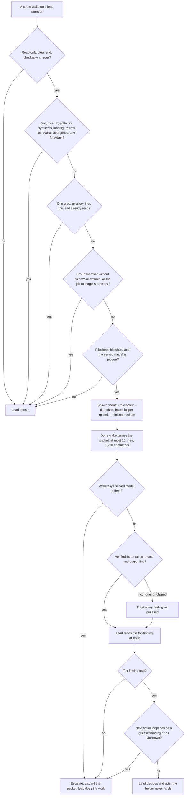

# Team 2 findings · the signal fires at the moment of decision

Read-only study at `39b77b3`. No tests, builds, model runs or helper jobs ran. Every code claim below was read in the file it names. Every source claim was fetched on 2026-10-10.

**Result.** The hypothesis is half true. For the coordinator it is false: `hook/communication.ts` `before_agent_start` (:43-62) puts `templates/agents.md` in the system prompt of every coordinator call (:98-102), so a routing table there is not "read an hour ago". For a job it is true: job runs skip `agents.md` (:98), and only the role preamble (`src/runtime/engine.ts:221`, `--append-system-prompt`) and the task reach the agent. Of the five signals in the approach note, one survives (the failed-job triage clause, after the pilot keeps triage) and four are cut. Two signals the note missed survive, because the wake text today says the wrong thing at the moment of decision: a served-model mismatch fact, and a scout's done wake that says "land it". Every kept signal lives in the message stream (the wake), never as a conditional line in the system prompt.

## 1. Delegation map

| Place | File and hook or function | Who decides today | Haiku fit | Signal that should reach the agent |
| --- | --- | --- | --- | --- |
| Coordinator, before a spawn (scout first?) | `hook/communication.ts` `before_agent_start` :43-62 loads `templates/agents.md` each call (:98-102); `agents.md:64-66`, `:147`, `:166` | Coordinator, from shop-manual prose | yes | Team-1's routing row in `agents.md`. No hook: there is no pre-spawn event. `tool_result` on `limen spawn` (`isVisionCommand` :381) fires after the spawn ran. |
| Coordinator, the helper spawn command | `src/commands/spawn.ts` `resolvePreamble` :73-83 loads `--role`; requested model only in env `LIMEN_MODEL` (:507, :584) | Coordinator; model from board TRACK (`spec/build.md:7`) | yes | Prose: `--role scout --detached`, board helper model. Prerequisite for row 5: record the requested model in the job record. |
| Failed or stopped job wake, Pi lead | `hook/wake.ts:432` calls `src/job/wake-text.ts` `completionWake` :44-84; failed instruction :66 | Coordinator | yes (triage) | One clause in the shared handoff sentence (:61-64), after the pilot keeps triage. |
| Failed or stopped job wake, OMP lead in Herdr | `src/integrations/coordinator-wake.ts` `wakeMessage` :83-84 passes `routeInstruction`, which replaces :66 (`routeInstruction ?? instruction`, wake-text.ts:82) | Coordinator | yes (triage) | Same handoff sentence; it is the only failed-state text both paths carry. Side defect: :83 says "before landing" for every state. |
| Helper done wake: the packet arrives | `completionWake` facts :59-60 (precedent: `producedNothing`); handoff :62-63 "land it"; `handoffExcerpt` :29-33 | Lead reads the packet | lead work | Served model ≠ requested model (fact line). For `role` = scout: "nothing to land; read the top finding" instead of "land it". |
| Packet budget in the wake | `handoffExcerpt` :31 cuts 15 lines, then 1,200 characters | nobody | n/a | Prose only (scout role): at most 1,200 characters, `Verified:` on line 3. No wake parser. |
| Worker inside its turn (internal scout) | Jobs skip `agents.md` (`communication.ts:98`); `templates/worker.md` rides the system prompt (`engine.ts:221`); bridge only when the job model starts `pi-claude/` (`engine.ts:224`); overlay `prepareSkillConfig` :134, `--config` :219 | Worker, via the OMP built-in task tool | after pilot | Config, not a hint: `task.agentModelOverrides` in the overlay. A `worker.md` line only after that route exists. |
| Test or log triage in a worker | `templates/worker.md:25` (discriminating check) | Worker | after pilot | None until the internal-scout route exists. |
| Review pre-pass | `templates/agents.md:150` (step 5), `spawn --review` | Coordinator; board says Adam reviews (`spec/build.md:10`) | after pilot (pilot task 5) | Prose row in `agents.md`. No done-wake hint: that wake already carries land, keeper and continue instructions (:68). |
| Team coordinator after its hypothesis (team scout) | `templates/group-member.md:3`; `templates/coordinator.md:7`; `hook/group-peer.ts` `tool_call` :161-165 and `before_subagent_spawn` :166-170 block members | Team coordinator, inside Adam's allowance rule | after pilot and Adam | Prose in `coordinator.md:7` or the team note. Not in the group-peer stream. |
| Team worker | `templates/group-member.md:5` | nobody | no | None. |
| Lead: cabinet events pile up | `src/job/group-events.ts` `acceptBatch` :236 (8 events, 8,000 chars), :261 "N more eligible events retained"; `hook/group-peer.ts` sweep :120-159, `tool_result` :171-184 | Lead | yes, at synthesis | None new. The lead has no `LIMEN_GROUP_ID` (set only for members, `spawn.ts:500`, `continue.ts:491`; refused at `group.ts:166`), so a digest job is outside the team allowance. |
| Lead: synthesis and candidate table | `templates/agents.md:33`; `hook/group-peer.ts` `leadSteps` :71-102 sees `synthesis.md` only after it is written | Lead | yes (table) | Prose in the `agents.md` group section; the lifecycle `state done` events already tell the lead when teams finish. |
| Lead fallback wake | `wake-text.ts` `groupLeadWake` :103-116 | Lead | no | None. |
| Running-job advisory | `wake-text.ts` `advisoryWake` :117-135 | Coordinator | no | None. |
| Research judge pre-filter | `templates/judge.md`; `agents.md:178-193` | Coordinator | after pilot | Prose only. |
| Keeper, picture, quality | `agents.md:95`, `:154-156` | Coordinator | no | None. |
| The helper's own stop | proposed `templates/scout.md` | Haiku | yes | Prose: write `Unknowns` and `Verified: none`; the helper does not escalate itself. |
| `ticket check`, `picture build`, tests | CLI | no model | no | None. |

### Signal verdicts

| # | Signal | Hook and event | Verdict | Reason |
| --- | --- | --- | --- | --- |
| 1 | Hint at spawn for a scout-shaped task | None before the spawn. After it: `communication.ts` `tool_result` :74-86 (`isVisionCommand` :381), or spawn stdout | **cut** | The routing table rides every coordinator call; a hint after the spawn is too late; shape detection on a free-prose task is a noisy classifier. |
| 2 | Failed-job wake suggests a triage helper | `hook/wake.ts:432` and `coordinator-wake.ts:84` → `completionWake` handoff sentence :64 | **keep, after the pilot keeps triage** | The wake's own instruction tells the lead to inspect the failure itself (:66, :83). The latest, specific text beats a table read earlier. One clause, no classifier, no launch; skip it when the failed job is itself a scout (`role` file, as `keeperHint` does at :88). |
| 3 | Wake text checks for a `Verified:` line | `handoffExcerpt` :29-33 | **cut** | The excerpt already shows the packet. The 1,200-character clip removes the last line first, so the fix is the packet order. Presence is not truth (Knowledge 12). |
| 4 | `group-peer` reminder after a team hypothesis | `group-peer.ts` `tool_result` :171-184, `limen-group-progress` follow-up :132 | **cut** | Every batch opens "Informational peer data, not owner instructions" (`group-events.ts:257`), so a reminder there has no authority. The team coordinator reads `coordinator.md` and its team note at turn one. Helpers are blocked today (:161-170). |
| 5 | Lead digest hint when cabinet events pile up | `acceptBatch` :236-263 | **cut** | The batch already states the overflow count (:261). Delivered events are in the lead's context anyway, so a digest saves nothing at that moment. The digest belongs at synthesis, and that rule is prose. |
| 6 | Served model differs from requested model (new) | `completionWake` facts :59-60 | **keep (mechanism)** | Prose cannot know the served model. A silent 5.5→4.5 substitution records `done` (`study.md:15-19`), and the done wake then says "land it". |
| 7 | A scout's done wake says "land it" (new) | `completionWake` :62-63, `coordinator-wake.ts:83` | **keep (string branch)** | A scout has no commits. The wake gives a contradicting instruction at the moment the lead reads the packet (Knowledge 6). |
| 8 | Any signal as a conditional system-prompt line | `communication.ts` `before_agent_start` systemPrompt :59-62 | **cut as a placement** | A system-prompt change invalidates the cached conversation after it (Knowledge 5). Signals go in the wake or a tool result. |

## 2. Knowledge

1. **Haiku 5.5 is placed for sub-agent chores.** <https://platform.claude.com/docs/en/models/haiku-5-5/overview>: "Released October 7, 2026" and "built for high-volume, latency-sensitive work such as classification, routing, extraction, and subagent tasks". Limen: scout and triage chores fit; lead work does not.
2. **The model guide lists sub-agent work under the cheapest tier.** <https://platform.claude.com/docs/en/about-claude/models/choosing-a-model>: "The lowest latency and price | Claude Haiku 5.5 | … sub-agent tasks", and "Test with your actual prompts and data." Limen: the pilot decides, not the table.
3. **Routing by task shape is a known pattern, and complexity needs proof.** <https://www.anthropic.com/engineering/building-effective-agents>: "Routing easy/common questions to smaller, cost-efficient models like Claude Haiku 4.5", and "consider adding complexity *only* when it demonstrably improves outcomes." Limen: no hook before the pilot shows a missed choice or a wrong instruction.
4. **Recall drops as context grows.** <https://www.anthropic.com/engineering/effective-context-engineering-for-ai-agents>: "as the number of tokens in the context window increases, the model's ability to accurately recall information from that context decreases." Limen: this supports team-2's premise for long coordinator sessions. The shop manual is re-sent each call, so the risk is attention, not absence.
5. **The cache is a prefix; a mid-session system-prompt change is expensive.** <https://platform.claude.com/docs/en/about-claude/models/optimizing-for-cost-and-intelligence>: "The cache is a byte-exact prefix match over the request in order (tools, then system prompt, then messages), so a change anywhere invalidates everything after it." Limen: a decision-moment signal must be appended in the message stream (wake, tool result), never as a conditional system-prompt line.
6. **Contradicting rules cost accuracy.** Same page: "Text that no longer fits the model costs accuracy instead: a retired thinking setting, contradictory rules, and a hand-rolled scratchpad … each restored 7 to 11 points on Opus 5 when removed". Limen: fix the wake strings that contradict the routing table ("land it" for a scout, "inspect it yourself" for a failure) instead of adding a second rule.
7. **Reminders belong near the end, in the user turn.** <https://platform.claude.com/docs/en/build-with-claude/prompt-engineering/claude-prompting-best-practices>: "Queries at the end can improve response quality by up to 30 percent", and "For very long conversations, inject what were previously prefilled-assistant reminders into the user turn." Limen: the wake is a user turn at the end of the context; that is where a kept signal goes.
8. **Cheaper models do not escalate on their own.** Optimizing page: "Claude Haiku 5.5 and Claude Sonnet 5.5 called the Opus 5.5 advisor on none of the 198 questions". Limen: escalation is lead-side. The helper writes `Unknowns` and labels; the lead reads and decides.
9. **A tool description alone under-triggers; a prompt at the right point raises use.** Optimizing page: "With only the tool's built-in description, executors under-call, especially on coding work". Limen, by analogy (advisor consults, not delegation): a routing table alone can under-fire, which supports one clause at the failed-job wake.
10. **Current Claude models over-delegate.** Best-practices page: "Claude Opus 4.6 has a strong predilection for subagents and may spawn them in situations where a simpler, direct approach would suffice", and the sample rule "For simple tasks, sequential operations, single-file edits … work directly rather than delegating." Limen: the not-use rule; a signal that fires often pushes over-delegation, so keep signals rare.
11. **A delegated task needs a format and boundaries; multi-agent costs tokens.** <https://www.anthropic.com/engineering/multi-agent-research-system>: "Each subagent needs an objective, an output format, guidance on the tools and sources to use, and clear task boundaries", and "multi-agent systems use about 15× more tokens than chats." Limen: `scout.md` carries the packet; combine small chores, because each helper costs a cold start of 10-15K tokens (`study.md:27`).
12. **Self-verification of a weak model is noisy.** AutoMix <https://arxiv.org/abs/2310.12963>: "given that self-verification can be noisy, it employs a POMDP based router". Limen: a `Verified:` line is a claim; the lead reads the top finding before acting (`study.md:143`).
13. **Cascades and routers decide automatically; Limen must not.** FrugalGPT <https://arxiv.org/abs/2305.05176>: "FrugalGPT, a simple yet flexible instantiation of LLM cascade which learns which combinations of LLMs to use"; RouteLLM <https://arxiv.org/abs/2406.18665>: "router models that dynamically select between a stronger and a weaker LLM during inference"; <https://arxiv.org/abs/2310.03094>: "we consider the “answer consistency” of the weaker LLM as a signal of the question difficulty". Limen: keep the transferable part, the weak model's uncertainty as an input (`guessed`, `Unknowns`, `Verified: none`); the router is the lead. The ticket forbids automatic routing and fallback.
14. **A sub-agent summary is short by design.** Context-engineering page: "returns only a condensed, distilled summary of its work (often 1,000-2,000 tokens)". Limen: the 1,200-character packet is tighter; it fits a scout, but a cabinet digest must point at a file, not fit the wake.
15. **Per-subagent model is explicit config; the Explore default is no longer Haiku.** <https://code.claude.com/docs/en/sub-agents> (redirect from `docs.claude.com`): Explore "Model: the main conversation's model", "define one with `model: haiku` to run exploration on a lower-cost model", and subagents "count toward the same usage limits as your main conversation." Limen: the brief's "Haiku `Explore` agent" premise is out of date; the Limen analog is `task.agentModelOverrides` in the overlay; a helper spends the same Max-plan quota.
16. **The helper effort default matches the study.** Choosing-a-model page: "On Claude Opus 5.5 and Claude Haiku 5.5 the default is `medium`". Limen: `--thinking medium` for the helper is the default, not a downgrade.

## 3. Proposal

Order is dependency order. Items 1 and 2 are team-1's prose; team-2 agrees and adds nothing at the spawn moment.

1. **`templates/agents.md`** (prose). Team-1's use / not-use / escalate table beside the board-model rule (:64-66). It wins at the spawn moment because it rides every coordinator call (`communication.ts:98-102`) and no pre-spawn event exists.
2. **`templates/scout.md`** (prose). The `study.md` packet with `Verified:` on line 3, the whole packet at most 15 lines and 1,200 characters, `observed`/`guessed` on every finding, and "do not escalate; write `Unknowns`". Why: `handoffExcerpt` (:31) clips the tail first.
3. **Requested model in the job record, one session reader** (mechanism). `src/commands/spawn.ts` writes the requested model next to `LIMEN_MODEL` (:507). One reader of `.limen/jobs/<id>/session/*.jsonl` serves `limen jobs <id>` (`ticket.md:38-39`) and item 4. Why: prose cannot know the served model.
4. **`src/job/wake-text.ts` `completionWake` facts (:59-60)** (mechanism, reuses item 3). Add one line only on a known mismatch: "Served model claude-haiku-4-5 differs from requested pi-claude/claude-haiku-5-5." Silent when they match or the transcript is absent; never claim a match. Why: the lead acts on the packet in this wake.
5. **`completionWake` handoff (:62-63) and `coordinator-wake.ts:83`** (prose branch). When the job's `role` file says `scout`: "Scout packet. Nothing to land. Read the top finding at Base before you act." Why: today both wake paths tell the lead to land a branch with no commits. The `keeperHint` role check (:88) is the precedent. Fix the OMP "before landing" wording for failed states in the same slice.
6. **`completionWake` failed handoff sentence (:64)** (prose clause, after the pilot keeps triage). Append: "A read-only triage scout can collect the first failure and the log tail; you decide." Not for a failed scout. Why: it is the only failed-state text both wake paths carry.
7. **`templates/coordinator.md:7`** (prose, only after Adam answers the allowance question). "One team scout after your hypothesis uses one launch slot." No `group-peer.ts` change.
8. **`src/runtime/engine.ts` overlay** (mechanism, after the pilot). Write `task.agentModelOverrides` and load the bridge for a helper route that names `pi-claude/` (`engine.ts:224`). No `worker.md` line until this route exists.

Not proposed: a spawn-shape hint, a wake-side `Verified:` parser, a group-peer reminder, a pile-up digest hint, or any conditional system-prompt line.

**When to use a helper.** The chore is read-only, has a clear end and a checkable answer (a path and line, a first failure, an acceptance-to-evidence table), and a lead decision waits on it. Its packet should remove more lead turns than its 10-15K-token cold start costs. The pilot has kept that chore, and the helper route's served model is proven.

**When not to.** The answer is one grep or a few lines in files the lead already read. The chore is judgment: a hypothesis, synthesis, choosing a candidate, landing, review of record, the judge's divergence, or text Adam reads. The caller is a group member without Adam's allowance. The failed job is itself a helper. Never as an automatic step or a model fallback.

**When to escalate to the lead.** The lead does the work itself, and starts no second helper, when the served model differs, the top finding is false when read, `Verified:` is `none`, absent or clipped, the next action depends on a `guessed` finding, or `Unknowns` names the seam. The helper never escalates itself (Knowledge 8); the lead reads and decides.

## 4. Decision flow

## 5. Points from the other team

1. **Team-1: cut shape detection at a generic spawn; `agents.md:64-66` already puts board choices before spawn.** Answer: agreed. `communication.ts:98-102` loads the shop manual on every coordinator call, and no pre-spawn event exists. Changed our result: yes, signal 1 is cut.
2. **Team-1: the failed-job wake is the better candidate; `completionWake` knows the state.** Answer: agreed, with a location fix. `coordinator-wake.ts:83-84` replaces the failed instruction for OMP leads, so the clause goes in the shared handoff sentence (:61-64). Team-1 checked and accepted. Changed: yes, the location.
3. **Team-1: a `Verified:` presence hint must not imply truth (`study.md:139-144`).** Answer: agreed. We cut the wake-side check, and both teams moved `Verified:` near the top of the packet because the clip removes the tail. Changed: yes, signal 3 is cut.
4. **Team-1: job runs skip the shop manual (`communication.ts:98-103`), so worker routing cannot rely on that table.** Answer: agreed. Worker routing is config (proposal item 8); `worker.md` still rides the system prompt (`engine.ts:221`). Changed: no.
5. **Team-1: keep wake and peer hooks unchanged until a missed choice is observed.** Answer: agreed for peer hooks (signals 4 and 5 cut). Not for two wake strings: the done wake tells the lead to land a scout with no commits, and the OMP failed wake says "before landing". Those are wrong instructions in code today, not guesses about a missed choice. Changed: no.
6. **Team-1: one session reader shared with `limen jobs`; never parse twice; never claim a match from an absent transcript; at first, a wake line only if the pilot shows the lead acts without opening `limen jobs`.** Answer: agreed on one reader and silence when absent. On timing: the packet is sized to arrive in the wake (`brief.md:13`), and `pilot.md:14` already needs a by-hand served-model check after every run. Team-1 then accepted a known-mismatch-only wake line (their commit `7dd224c`). Changed: yes, proposal items 3 and 4 share one reader, and `limen jobs` comes first.
7. **Team-1: the lead pane has no `LIMEN_GROUP_ID`, so a lead-side digest does not use team slots, but the lead still chooses that spend on purpose.** Answer: agreed; we found the same in `spawn.ts:500` and `group.ts:166`. Changed: no.
8. **Team-1: the OMP failed-job landing wording is a separate defect.** Answer: it is separate from Haiku, but the scout done-wake fix edits the same string (`coordinator-wake.ts:83`), so one slice should fix both. Changed: no.

Uncertainty: nothing here was run. The claim that a wake clause changes lead behavior is untested; pilot task 2 (triage) is the first place to see it.
